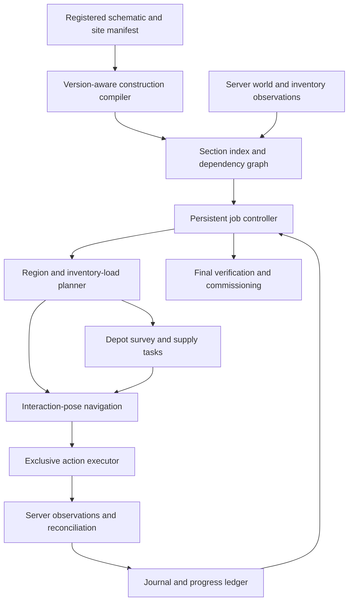

# Autonomous island builder: audit and implementation plan

**Audit date: 3 September 2026. Verdict: the current system is a useful collection of automation components, but neither the installed 0.8 nor the locally built 0.8.1 candidate is established as an autonomous construction system. The candidate has concrete release blockers, including regressions introduced in the previous patch.**

This audit follows the entire requested job: resolve a schematic and its island, inspect the world, select genuinely executable placements, obtain supplies, build, return for another load, recover from interruptions, and account for every remaining cell. The recommendation is to introduce a persistent job controller and action model, then migrate the existing components behind them. Adding more conditions to `Hud` and `Autopilot` will not resolve the shared-state problems.

## Current implementation status

The findings below describe the frozen audit baseline. Subsequent source fixes and their validation are tracked in [AUTONOMY_IMPLEMENTATION_PROGRESS.md](AUTONOMY_IMPLEMENTATION_PROGRESS.md). They include exact linked-site bounds, state matching, action ownership, observed inventory reconciliation, conservative ground routing, immutable input revisions, placement-action evidence, withdrawal transfer evidence, an explicit autonomous-build registration gate, legal chest approach selection, special-action preflight classification, balanced multi-material refill allocation, double-slab and multi-face vine recipes, and vanilla door/bed initiator ordering. These do not close all findings, and the installed 0.8 and prior candidate JAR have not been replaced. The latest local suite passes 513 Java tests; launched-client and full build/refill/recovery proof remain outstanding.

## Evidence and limits

- User-confirmed installed version: **0.8**. Baseline artifact: `chunkscan/build/libs/chunkscan-0.8.0.jar`, SHA256 `d2a38e2f2deff4d32aa0eef2bab34893fec7fc0d737d67279287979c7fbdcc52`.
- Current uninstalled candidate: `chunkscan/build/libs/chunkscan-0.8.1.jar`, SHA256 `40f9f01ada7ddb8a2aac257d4ea82540c478c3e00338bf5ff96e16b23a37d968`. Its manifest requires Minecraft **26.2**, Java **25**, Fabric loader **>=0.19.3**, and Fabric API. The repository's construction target is separately locked to **Skyblock 1.19**.
- Detailed source findings below refer to the current **0.8.1 candidate source**, unless explicitly identified otherwise. A candidate defect is not automatically a claim about identical bytecode in installed 0.8. The earlier [placement audit](AUTOPLACEMENT_AUDIT.md) records the baseline changes.
- Reviewed the build loop, navigation, schematic/state handling, placement, storage discovery, inventory transfers, shulker handling, digging, restart/fleet persistence, ancillary automation interfaces, packaging, tests, Python export policy, and actual park/profile inputs. The coverage table distinguishes core implementation review from peripheral interface review; this is not a claim of formal verification of every utility method or dependency.
- Read-only production-method probe: real `Work.load`, `Islands.outside`, `Storage.scoped`, Minecraft item registries, `Rules.inLockedProfile`, and `Work.matches`. Independent Python decoding agreed on the frozen schematic's non-air count.
- **No live client/server build was run in this audit.** Packet ordering, flight permissions, protection-plugin behavior, and shulker recovery remain unproven. Unit tests and source inspection cannot certify them.
- Generated park files changed during inspection. Final numbers below use a frozen, hash-recorded snapshot; earlier commentary's 533,258-cell figure was a previous revision. The final snapshot has **532,374** cells. This is also direct evidence that active jobs must pin input revisions.

Reproducible diagnostic sources, input hashes, source fingerprints, and measurements are in [audit/README.md](audit/README.md) and [audit/evidence.json](audit/evidence.json). Raw frozen inputs remain under the ignored `build/audit/autonomy/snapshot` directory. No installed mod or game profile was changed by this audit.

## The actual workload changes the design

The tracked game-profile design is `Park Complete`. The frozen repository artifact has SHA256 `88d570a76d2fe875474930f4836318ee3daafb3774a972cd68de5d9792ce0e1f`.

| Measurement | Result | Consequence |
|---|---:|---|
| Schematic dimensions, X × Y × Z | 200 × 220 × 600 | Whole-island work needs chunk/section indexing and planned travel |
| Schematic volume / non-air cells | 26,400,000 / 532,374 | A flat scan per placement does not scale well |
| Origin | 97500, 94, 80300 | Origin alone cannot identify the whole job's storage network |
| Sidecar registration | `PREVIEW placement; rebase before building` | Automatic execution should fail preflight |
| Explicit dig entries | 9,846 | Placement-only completion cannot finish this job |
| Cells excluded by current plot model | **359,647 (67.56%)** | Most of the intended footprint is filtered out |
| Eligible cached containers under current origin scope | **0** | The stock/refill loop cannot use the park's main depot |
| Cells lacking a same-name BlockItem | **8,475** | Need material-to-action recipes, not block-name lookup |
| Cells carrying properties Python intentionally omits | **31,855** | Full-state placement matching changes existing semantics; this is exposure, not a count of failed placements |
| Cells rejected by the locked block-name list | **237** | `iron_chain` (134) and `short_grass` (103) require version-name translation |
| Offline cold Java decode, final diagnostic run | 1.40 seconds | Loading must not block a normal game tick; this is not an in-game performance benchmark |

The registered park islands still have radius 49. `tools/park_anchor.py` and `park_final.world.json` instead describe three expanded 200×200 plots, forming X **97500..97699**, Z **80300..80899**. A symmetric inclusive radius cannot exactly represent an even-width 200-block plot: radius 99 is 199 wide, radius 100 is 201 wide.

| Intended expanded plot | Z bounds, inclusive | Cached container records | Cached loose items |
|---|---|---:|---:|
| Left | 80300..80499 | 0 | 0 |
| Middle | 80500..80699 | 65 | 163,546 |
| Right | 80700..80899 | 1 | 22 |
| Old main island, elsewhere | 29951..30049 | 176 | 184,405 |

These are last-observed records, including container types that may not be usable depots; they are **not verified current stock**, nor proof that all items suit this build. The origin resolves to `islandleft`, so the current single-island storage filter excludes the middle plot's depot altogether. The old main island must remain a separate site unless an explicit transport/depot relationship authorizes using it.

The current artifact also exceeds the documented 265k target budget. That is a preflight reconciliation item, not authorization to change the design. The WorldSpec build plane is 203 while the artifact volume begins at 94; those values need not be equal, but their transform and registration need one authoritative manifest. Older prose also contains an earlier Z anchor. `protected: []` in the current WorldSpec is not evidence that the existing Isthmus or user builds are disposable.

## Release blockers and required improvements

Priorities: **P0** prevents trustworthy unattended operation or can act against the wrong context; **P1** prevents full coverage/reliable recovery; **P2** improves efficiency and extension. IDs are used by the implementation stages below. Findings are code-confirmed unless a narrower evidence statement is given.

### A01 — P0: bind execution to a registered, immutable job

`Designs.load` reads origin and dig cells but does not enforce `anchor_status`, server identity, dimension, registration approval, or a schematic/sidecar hash pair. `Work.load` refreshes files by size/time while a job is active. The frozen artifact explicitly says preview/rebase, yet these loaders accept it. `Session` records only design name, autofly, follow-all, and speed.

**Change:** compile a `BuildManifest` containing server identity, dimension, site, source/sidecar hashes, data version, exact transform, approved placement registration, policy revision, and permitted operation classes. Hold an immutable job revision for the run. New generated files create a proposed revision; an explicit rebase/reconciliation step adopts it. Unknown context or invalid registration produces a named preflight failure. Do not silently turn schematic air into demolition.

**Acceptance:** this frozen preview is rejected before any movement or inventory action; replacing its file mid-run does not change the active job; reconnecting to another server at the same coordinates cannot resume it.

### A02 — P0: model a site as exact plots plus linked depots

`Islands.contains/outside` uses nearest center and radius. `Storage.scoped` selects only the island nearest the schematic origin. The production probe reproduces the 359,647 excluded cells and zero eligible containers. `Islands.outside` also treats a location outside every known island's association range as not outside when the registry is nonempty: unknown location is effectively allowed.

**Change:** exact half-open plot rectangles or polygons, optional Y limits, site membership, separately authorized depot sets, transit routes, protected volumes, and account capabilities. A build can span several plots; its depot can serve all of them without making unrelated islands available. Unknown build permission is `UNVERIFIED`, not allowed. Import the park's plot program rather than inferring it from a center.

**Acceptance:** all intended 200×600 columns classify correctly, the one-block rim is excluded, middle-plot depots can supply left/right work, and unrelated-site stock is never selected. Protection includes existing user work and the Isthmus even where it is absent from a generated file.

### A03 — P0: compile desired state into attainable actions

The new `LitematicReader` emits every palette property. `Work.matches` compares all supplied properties; `Printer.placement` requires the immediate client-predicted state to match. This bypasses `mcbuild/work.py`'s intentional-property policy and is a **regression introduced by the previous patch**. Leaves' distance, rail power, and neighbor-derived shapes are examples where final schematic state is not an immediate placement result. The offline matcher rejects default oak leaves against `distance=1` while accepting their identity.

**Change:** classify each property as an intentional invariant, derived state, transient state, or commissioning requirement. Preserve raw state for final validation; use action-specific immediate postconditions for placement. Do not simply strip every property Python omits: waterlogging, rail shape, and functional power can be essential to the finished ride. Generate shared policy from one source so Java and Python cannot drift.

**Acceptance:** leaves place before neighbor convergence; powered rails can be placed unpowered and commissioned later; wrong slab half, axis, facing, and required vine attachment remain detectable.

### A04 — P0: distinguish client vocabulary from target-server semantics

The client is 26.2 while the building profile is 1.19. The reader ignores schematic `MinecraftDataVersion`; the new name-only guard rejects `iron_chain` and `short_grass` in the actual artifact. The intended 1.19 equivalents are `chain` and `grass`. Client `getStateForPlacement` is not proof of server placement semantics or plugin permission.

**Change:** explicit import normalization and server/client translation, preserving unknown states as actionable preflight errors. Define capability probes for supported server interactions, reach, flight, protocol translation, and available item/state vocabulary. Test the exact launched client/mod stack and the target-server path; do not infer compatibility from successful compilation.

**Acceptance:** round-trip the 237 renamed cells without changing meaning; reject genuinely post-1.19 blocks; validate stateful interactions on the real protocol path.

### A05 — P0: one controller must own the actuators

`ChunkScanClient.printerTick` advances crafter, smelter, shop, farm, photo, unbox, digger, and printer through separate routines. Some screen/busy checks exist, but there is no global ownership model for movement, rotation, held slot, cursor, menu, placement, or breaking. The digger runs before the printer's busy checks. Independent stop/failure handlers can leave other routines active.

**Change:** a job controller with exclusive action ownership, explicit acquisition/release, cancellation boundaries, and emergency preemption. Ancillary commands submit actions to the same controller. Opening a chest, crafting, photographing, or digging must not compete with a placement for rotation/slots. Global stop releases inputs and resolves or records every in-flight action and deployed temporary asset.

**Acceptance:** exercise simultaneous dig/print/craft/unbox requests; exactly one compatible actuator owner exists per tick. Stop/disconnect at every phase cannot leave a held movement/break command or silently resume a half-finished operation.

### A06 — P0: make inventory and world edits acknowledged transactions

The candidate improves placement by waiting for a prediction-sequence acknowledgement. However, main-inventory-to-hotbar SWAP does not wait for a server-confirmed slot result. `Withdraw` treats nonzero menu state ID as initial-content readiness and any subsequent state ID change as a transfer barrier. Those are assumptions about acknowledgement, not a transaction covering the expected slots. `ContainerWatcher` snapshots client menus each tick, including locally predicted changes, then persists the last snapshot at close.

**Change:** capture authoritative inventory/content update events with menu/session identity, expected source/destination slots, item components, cursor state, and world revision. Transaction lifecycle: prepare → dispatch → await relevant observations → reconcile → commit or bounded recovery. A timeout is `UNKNOWN_OUTCOME`; inspect before retrying. Sequence acknowledgement means processed, not necessarily successful placement; also verify the action's world/inventory effects. Require an authoritative update covering relevant state, not an arbitrary delay.

**Acceptance:** delayed initial contents, unrelated slot updates, rejected swaps/clicks, menu replacement, partial stacks, cursor residue, disconnect after send, and late server correction never count as completed transfers/placements prematurely.

### A07 — P0: navigation must finish at an executable interaction pose

`Hud.fetchTo` begins withdrawal using block-position distance; `Withdraw.open` uses eye-to-chest distance plus line of sight. `Autopilot` pauses while withdrawal is busy. Thus a chest can be considered arrived from a point where it cannot be opened, and the routine that would move closer has already stopped. A chest behind a wall is a direct counterexample even when all distance thresholds pass. `ChestScan` also starts inspection without proving an opening ray.

**Change:** goals describe a valid player pose and interaction, not only a block coordinate. The planner must find reachable standing/hovering positions with body clearance, an unobstructed valid click face, reach margin, required aim, and a return route. Navigation owns approach; the interaction acquires control only after that shared predicate passes. A denied pose is invalidated so a different side is tried.

**Acceptance:** chests at reach boundaries, behind corners, recessed into walls, and under low ceilings are either opened from another valid pose or reported unreachable without repeated frozen opening attempts.

### A08 — P0: shulkers need a recoverable lifecycle and identity

`Unbox.take` advances to breaking when `Withdraw.busy()` becomes false, even after failure; it does not require a successful withdrawal result. `Autopilot` pauses throughout `Unbox.running`, while recovery only waits for box inventory count to return. There is no pickup route. A drop outside pickup distance therefore cannot be retrieved by this routine. Ownership is a remembered flag plus position/block type, not a persisted instance/component identity. Some failure paths stop the whole loop; others only fail the subroutine.

**Change:** reserve a reusable depot unpacking pad or approved field pad, retain the box's item/component identity, reserve return capacity, verify withdrawal outcome, break with tool/ray/world confirmation, navigate to the drop, confirm pickup, and reconcile contents. Journal the deployed asset before placing. On interruption, recover that asset before ordinary work resumes. Never clean up a block that no longer matches the expected deployed asset.

**Acceptance:** partial/full boxes, nearly full packs, failed withdrawal, drop beyond pickup radius, disconnect before pickup, and an unexpected replacement at the pad all preserve assets and produce a truthful result. Repeated `startDestroyBlock` behavior also needs live validation; this audit does not assume its exact server effect.

### A09 — P1: plan the construction order and temporary work

`Work.placeableNow` checks real neighboring support and avoids sealed targets; `Printer.placement` adds the useful final ray/shape/survival check. These are valuable primitives. They do not plan future access. Bottom-up sorting plus nearest cells can close a shell around unfinished interiors, remove access to a support face, or strand a separate floating component. A currently empty frontier is not proof the design is impossible.

**Change:** a dependency graph with final-block support, attachment, multi-block effects, access/escape reservations, temporary scaffold/pad actions, and cleanup. Build accessible interiors before closing skins, preserve a service opening, and delay closures until descendants are verified. Scaffold material must be explicitly allowed and reserved; never consume dirt/grass currency as generic throwaway support. Use WorldSpec plot/routes/protected areas and module boundaries.

**Acceptance:** hollow shell with interior, overhang, underside, separated floating component, tall column, and last singleton all finish without sealing work in or leaving unauthorized scaffold. Impossible components report the missing support/access dependency instead of an endless movement loop.

### A10 — P1: replace block-name inventory matching with action recipes

`Printer.inventorySlot` requires a BlockItem whose item ID matches the requested block name. The frozen schematic contains 7,491 water cells, 818 redstone-wire cells, 161 wall signs, four wall redstone torches, and one water cauldron that do not satisfy that contract: **8,475 cells**. This is a lower bound on unsupported construction semantics. Double slabs require two uses; doors/beds have multi-cell effects and cannot be budgeted as one item per cell. Multi-face vines can need multiple uses.

**Change:** recipes mapping desired results to items, quantities, tools, support/context, ordered interactions, side effects, immediate observations, and final postconditions. Start with full cubes and common stateful blocks, then signs/dust, double slabs/multi-block structures, attachments, fluids/waterlogging, and mechanics. World diff must recognize legal intermediate states instead of marking a bottom slab as an unrepairable mismatch against a requested double slab.

**Acceptance:** each supported recipe has an in-game fixture; unsupported recipes are listed before execution, not discovered by empty inventory lookup after arrival.

### A11 — P1: storage discovery needs coverage and provenance

`ChestScan` considers loaded block entities within ±16 chunks and is invoked only at a dead end with a nonempty frontier. It cannot discover a depot in an unseen area by waiting in place, and it cannot help a job whose frontier is empty because it first needs supports. `Storage` distinguishes dimension but not server identity. Double-chest halves lack a canonical physical-container identity. Cached observations do not constitute reserved stock.

**Change:** persistent depot records keyed by server, dimension, site, and canonical container; observation revision/time/source; type/capacity; known approach poses; permission and access status. Use declared depot locations first, then a bounded survey route with coverage of permitted loaded/unloaded regions. Refresh stale or insufficient stock on arrival. Label known-empty, unseen, inaccessible, exhausted, and stale separately. Disable passive recording without disabling transaction identity tracking.

**Acceptance:** cold index, unloaded depot, empty initial chest, inaccessible chest, double chest opened from either half, another server at identical coordinates, and another player taking stock all yield correct behavior.

### A12 — P1: fill a useful inventory load, not merely every empty slot

Current refill policy prefers frontier materials, but quantities originate from the whole remaining `todo` and there is no persistent regional load manifest. Global shortage plus per-material filling can monopolize capacity with one abundant material. `PACK_FULL` asks the player to store something. Capacity calculation uses bare item IDs and may assume 64 when no matching stack exists; item components and required tools/return slots are not a complete inventory policy.

**Change:** choose an executable work region, reserve tools/food/emergency items/scaffold/box capacity, then pack a material mix that unlocks its dependencies. Track loose stock, boxed stock, reservations, expected consumption, and observed consumption separately. Include unloading leftovers to approved destinations. Optimize useful placements per trip and depot travel cost; “fill the pack” is a means, not the objective. Retain the same region when returning from refill unless new evidence changes feasibility.

**Acceptance:** a mixed-material region larger than inventory capacity completes over multiple trips; useless leftovers are deposited; protected user items remain untouched; a full pack cannot deadlock the run.

### A13 — P1: use movement actions and bounded observation

`Nav.of` and `standable` treat unloaded cells as passable. Foot routing uses the same broad neighbor search rather than validated walking/jumping/falling transitions; standability allows a block two below. More directly, `Autopilot` falls back from an unsuccessful walking route to `Nav.of`, which permits air. Execution has extra safeguards, but the resulting route is not evidence of a walkable path. A cell-passability model also misses exact player collision at partial blocks and action-specific movement costs.

**Change:** separate walking and granted-flight movement models, using legal transitions and swept player bounds. Unknown space is an exploration boundary; stop/replan at a safe observation point before executing it. For flight, model permission loss, contact clearance, braking/overshoot, narrow shafts, landing/takeoff, and escape. For walking, forbid movement across void unless an explicit approved bridge action supplies footing. Revalidate upcoming transitions after block updates and server position corrections.

**Acceptance:** one-wide shafts, stairs/slabs, low ceilings, air gaps, unloading chunks, permission loss, and detours initially moving away from the goal. No walking route may be justified solely by a flight-passability fallback.

### A14 — P1: recovery must respond to a cause and reconcile the job

`Recovery` escalates timers through back-off, climb-out, and `/is`. That can relocate the player, but it does not resolve inventory ambiguity, seal/access dependencies, or the outstanding action. A home command may reach a different site, and “open sky above” is not guaranteed by this park's vertical structures. `Printer` gives up after a small fixed retry count and does not key that decision to a changed support/pose/world revision.

**Change:** structured failure reasons and bounded recovery by cause: reload observations, choose another pose, refresh stock, unload, recover a box, use an authorized return route/warp, or block a specific dependency. Retry only after relevant evidence changes or a configured backoff. Reconcile site, inventory, world, and outstanding assets after teleport. Exhaustion stops with one precise actionable reason.

**Acceptance:** no infinite chest/station/warp cycling; progress counters measure confirmed useful effects, not time spent discovering or traveling.

### A15 — P0: completion, digging, and repair need explicit postconditions

`Work.Split.complete` includes mismatches, but `placementComplete` ignores them and the dig list, and the follow loop advances on the latter. Current messaging is more honest about leftovers than the old wording, but this remains insufficient for full completion. `digLeft` omits unloaded dig cells and swallows read errors. `Digger` checks protection/reach at target selection, lacks the printer's ray/acknowledgement contract, continues the chosen target without equivalent revalidation, and does not recover drops. Ordinary wrong blocks cannot be automatically repaired through the placement path.

**Change:** distinct `PLACEMENTS_EXHAUSTED`, `BLOCKED`, `AWAITING_COMMISSIONING`, and `COMPLETE_VERIFIED` outcomes. Keep unseen dig cells in the ledger. Explicit edit permits contain expected old state, allowed operation, protection policy, and drop handling. Repairs and temporary cleanup are planned actions; wrong blocks do not implicitly authorize demolition. Revalidate immediately before and during destructive actions, and confirm server/world effects.

**Acceptance:** mismatch-only, dig-only, unloaded-dig, corrupt-sidecar, protected-target, and changed-target jobs never report complete. Final verification visits every required area and checks construction plus required cleanup.

### A16 — P0: restart needs an action journal, not just intent

`Session` restores four intent fields after a fixed join grace period. It cannot distinguish a placement not sent, sent but unconfirmed, or confirmed just before disconnect; nor remember a deployed box or temporary support. File writes swallow failures. A fixed five-second wait is not proof the correct site and inventory are ready.

**Change:** durable job/action journal plus compact checkpoints, atomic writes, explicit persistence-health state, and load/reconnect reconciliation. Store action ID, input revision, expected effects, dispatched state, observation revision, and owned temporary assets. Resume idempotently from observed world/inventory state. Exactly-once network execution cannot be assumed; reconciliation makes retry safe.

**Acceptance:** inject disconnect/crash before and after each dispatch/observation/commit boundary. The run neither duplicates resource use blindly nor abandons a box or declares unobserved work finished.

### A17 — P1: fleet claims must be transactional and scoped

`Fleet` uses design-name claims and read-modify-write JSON without a lock. Atomic rename protects file integrity, not concurrent claim acquisition; writers even share a fixed temporary filename. `heldByOther` is a check, not an acquired lease. `finish` removes the design's claim without checking that the caller owns it. Shared storage has analogous lost-update risks.

**Change:** one local coordinator or a transactional store, scoped by server/site/job revision, with account identity, lease/fencing token, bounded work-region ownership, material reservations, and shared depot/pad exclusion. Ownership must be checked at action dispatch and completion. First prove a single worker; enable multiple accounts only after collision/lease recovery tests.

**Acceptance:** two accounts racing the same task produce one owner; expired workers cannot keep editing; losing a claim cannot overwrite another worker's stock reservation or finish its job.

### A18 — P1: index the world diff and move expensive work off the tick

`Work.split` iterates the whole cached cell list even for a small placement radius, then parses the sidecar dig list. `Hud` also recounts broadly. At 532k cells, repeated small-radius queries do unnecessary work. `Printer.placement` may search faces, shape boxes, and multiple yaw/pitch combinations, then repeat that work for the selected action. The final diagnostic's cold loader takes 1.40s offline. Actual tick costs and heap peaks have not been profiled in-game.

**Change:** palette-backed packed schematic sections, per-section status bitsets, spatial queries, dirty sections from world updates/chunk loads, cached compiled recipes, and frontier updates from affected neighbors. Parse immutable files on a worker; capture world snapshots on the client thread and never read mutable Level state from a background planner. Apply results only if their input revisions still match. Cap planner and interaction work per tick.

**Acceptance:** profile this full frozen workload with telemetry. Initial engineering target: builder work p95 ≤2ms/tick and p99 ≤5ms on the target machine, no long synchronous decode, and memory bounded by active sections plus a configured cache. These are proposed budgets, not achieved measurements.

### A19 — P1: structural placement is not functional park completion

`LitematicReader` reads palette/block arrays; it does not compile block-entity content, sign text, entities, or mechanism commissioning into work. The actual workload includes water, rails, vines, signs, and redstone. A count of correct block identities cannot prove a queue, bubble launch, railway, payment mechanism, or return route works.

**Change:** separate construction from commissioning tasks defined by the park contracts. Supported operations may configure signs, orient/toggle mechanisms, place permitted fluids, and run repeatable checks. Server-only mechanics or explicitly human proof obligations remain named gates. Completion reports distinguish the built shell, configured mechanism, and tested experience; they must never silently pretend creative NBT copying is a survival action.

**Acceptance:** each retained module inherits its entry/exit/service/return-route and live-mechanics proof obligations from the authoritative park documents. Unimplemented commissioning is visible before the job starts.

### A20 — P1: ancillary automation needs the same policies

Crafter and smelter require a suitable menu already open; shop/farm/photo have separate tick routines; tidy/move/fill include planning/export utilities. Their existence does not supply an autonomous acquisition chain. Crafting/smelting also need ingredient/fuel/tool/output capacity, station discovery and travel, and acknowledged recovery. A shared policy is absent across all actuators for currency, protected assets, and spending limits.

**Change:** adapt useful components into explicit station actions after the main building cycle is reliable. Material shortage becomes `FETCH`, `CRAFT`, `SMELT`, `GATHER`, or `BLOCKED` according to approved capabilities. No automatic purchases, unrelated harvesting, or currency spending merely because a recipe exists. Reserve resources and describe the planned acquisition before dispatch under the job's established policy.

### A21 — P1: tests must execute the state machine and its failures

The baseline passed 447 tests despite the original defects; the previous candidate passed **462 tests** with zero failures/errors/skips. The added 137-cell/three-load simulation tests planning arithmetic, not real movement, menu updates, packets, or placement. Source-string assertions and comments cannot establish gameplay behavior. The current offline audit exposed major failures without needing a server.

**Change:** retain useful format/pure-function tests, add a deterministic fake server/event harness around the controller, then client/server integration fixtures and an instrumented endurance gate. Assert invariants and final effects, not the presence of method names or explanatory comments. Keep a reproducible artifact manifest, dependency versions, resource hashes, logs, and actual scenario outcomes with each release.

## Proposed system and the full build cycle

1. **Preflight:** resolve immutable schematic/sidecar, target profile, site plots and depot permissions, transform, protected areas, available action recipes, and initial supply/commissioning gaps. The current preview stops here with the registration reason.
2. **Observe:** collect authoritative loaded-world and inventory state. Track unknown chunks explicitly. Survey declared depot approaches and contents; cached observations guide visits but do not commit transfers.
3. **Choose work:** select a bounded region whose support/access dependencies can be executed and whose return path remains viable. Reserve interior access before building the enclosure. Pick an approved temporary-support plan if needed.
4. **Plan one load:** calculate a useful material mix and reserve tools, recovery space, and temporary assets. Choose depot stops based on stock confidence, usable stock, travel, and permissions. Deposit leftovers if required.
5. **Supply:** navigate to a valid opening pose; acquire menu ownership; verify contents; transfer and reconcile. Unpack at a reserved pad through a journaled lifecycle. Resume only after the inventory load is actually available.
6. **Build:** navigate to a pose covering executable actions; select/swap the correct item with confirmation; recheck support, ray, protection, and world revision; dispatch one action; verify immediate effects; update dependencies. Adjust final derived-state verification after neighbor convergence.
7. **Refill:** when useful work exhausts this load, persist the region/frontier, return to the depot, unload/replenish, and resume that work. Do not repeatedly select distant global shortages without a load plan.
8. **Recover:** classify failures and reconcile unknown outcomes. Try alternative permitted poses/routes or changed stock; block a dependency after bounded attempts. Deployed boxes and temporary work remain owned obligations across restarts.
9. **Finish:** verify every section, mismatch, required removal, temporary asset, and commissioning gate. Produce a final result with verified, blocked, unknown, and human-proof counts. Only all required postconditions satisfied means complete.

Suggested persistent cell states: `UNSEEN`, `SATISFIED`, `READY`, `WAIT_SUPPORT`, `WAIT_ACCESS`, `WAIT_MATERIAL`, `WAIT_COMMISSIONING`, `CONFLICT`, `IN_FLIGHT`, `BLOCKED`. An action has its own lifecycle and may affect several cells. Store reasons and evidence revisions so changes can make blocked work eligible again.

An action record should include job revision, action ID/type, affected cells, expected old state, item/component requirements, pose/face, prerequisites, policy permit, expected effects, observations, retry cause/budget, and any compensating cleanup. This is the contract between planning, motion, inventory, and execution.

## What to take from Baritone

Baritone's process arbitration, goal-based pathing, movement costs, segmented search, and cached world representation are relevant architectural references. Its control manager explicitly selects a controlling process and handles loss of control; that separation addresses our competing routines. Its movement planner represents more than straight-line distance through passable cells. [Control manager source](https://raw.githubusercontent.com/cabaletta/baritone/master/src/main/java/baritone/utils/PathingControlManager.java), [documented pathing features](https://raw.githubusercontent.com/cabaletta/baritone/master/FEATURES.md).

**Recommendation:** keep our construction compiler, island/depot policies, supply planning, and job journal. Put navigation behind an interface and run a bounded experiment using Baritone for ground travel, while retaining a separate server-granted-flight implementation. Compare success, collisions, replans, and runtime on the same fixture routes. Reuse the adapter only if it meets our policy and compatibility requirements; otherwise replace `Nav` incrementally with movement actions behind that same interface.

The upstream README currently lists a **26.2 Fabric** download, so version availability alone is not a reason to reject an adapter. That listing is not proof of compatibility with this LiquidLauncher/client/plugin stack; exact artifact/API integration still needs testing. Do not substitute its general-purpose build behavior for our protected plots, currency rules, depots, and commissioning. [Official repository and download table](https://github.com/cabaletta/baritone).

The cited `master` implementation is an architectural reference, not a pinned 26.2 integration contract. Any implementation experiment must pin the selected release/commit and use its public API.

## Implementation order and exit gates

| Stage | Concrete deliverable | Required exit evidence |
|---|---|---|
| 0 — stop unsafe promotion | Mark 0.8.1 candidate blocked; preserve evidence; fix registration/site/state/version contracts (A01–A04) | Frozen park preflight correctly reports scope, stock, special actions, and preview status; no automatic placement from preview |
| 1 — execution kernel | Job context, exclusive action owner, authoritative observation adapter, journal, stop/resume (A05–A08, A15–A16) | Fault injection around every action boundary; no false commits; no unrecovered owned box silently discarded |
| 2 — complete simple-building cycle | Exact site/depot model, valid approach poses, load manifests, unloading, confirmed cube placement (A02, A07, A11–A12) | Empty-inventory start; discover/use depot; build >3 inventory loads; return/refill/resume; finish last cell without assistance |
| 3 — actual park construction | Shared version/state compiler; recipe families; dependency/access/scaffold plan; repair permits (A03–A04, A09–A10, A15) | Representative park sections with interiors, vines, slabs, signs, rails and fluids; zero hidden unsupported cell classes |
| 4 — navigation and scale | Compare ground adapter; flight movement model; section indexing; bounded planning (A13–A14, A18) | Route fixtures plus full 532k-cell workload profile; stable frame/tick budgets; no unknown-space execution or endless recovery |
| 5 — durable unattended operation | Long-run recovery, station acquisition where authorized, commissioning reports (A16, A19–A21) | Eight-hour fixture run with injected restarts/lag/stock changes; every outstanding action accounted for; final world diff and asset reconciliation |
| 6 — multiple accounts | Transactional coordinator, region leases, depot reservations (A17) | Racing workers, lease loss, reconnect, shared depot and pad contention preserve single ownership and stock accounting |

This order intentionally proves the simple supply/build/refill cycle before adding every block type or multiple workers. Navigation experiments can begin earlier, but they do not replace the stage 1 ownership/transaction contract. Stage estimates should follow the kernel and compatibility experiment; a credible calendar estimate cannot be inferred from line count.

## Validation scenarios that define autonomy

| Fixture | Required outcome |
|---|---|
| Three-plot park with middle depot | Build across the full permitted union and refill from its linked depot; exclude old main |
| Empty index, depot initially unloaded | Survey permitted routes, open and index actual storage, then build |
| All-air target and floating component | No air-place attempt; resolve approved support dependency or report blocker |
| Hollow shell and unfinished interior | Preserve access until interior verified; close shell last |
| Mixed materials, small usable inventory | Multiple useful refill cycles, unload leftovers, retain reserved items |
| Double slab, door, bed, vines, sign, dust | Correct action count, item consumption, multi-cell effects, state and text obligations |
| Water, waterlogging, rails and power | Separate initial placement from final stable/mechanism verification |
| Chest behind wall / exact reach boundary | Find another legal pose or bounded unreachable result |
| Delayed/rejected menu update | No speculative transfer counted as real stock |
| Shulker partially emptied, drop displaced | Confirm contents, recover correct box, resume without resource loss |
| Disconnect at every transaction boundary | Reconcile once, preserve job revision and temporary assets |
| Unloaded dig cell or mismatch-only remainder | Never report full completion |
| New source file during active build | Continue pinned revision; report proposed update separately |
| Changed/protected target during action | Cancel/reconcile; no unauthorized replacement or demolition |
| Flight revoked / route chunk unloads | Stop at safe boundary or use verified recovery capability |
| Two workers competing | One valid owner, bounded leases, no duplicate reservation |

Release criteria should include **zero unauthorized edits, zero false completions, zero unresolved item-loss incidents, and zero silent infinite retry loops** in these fixtures. Report useful confirmed placements/minute, return trips per useful 1,000 placements, time spent building/traveling/refilling/recovering, failure reasons, and tick/heap costs. Do not use attempted clicks or decreasing local predicted counts as the success metric.

## Source coverage and migration map

Key review entry points (line numbers refer to the fingerprinted source snapshot):

| Findings | Source entry points |
|---|---|
| A01, A03, A15, A18 | [Work loading and diff](/C:/Users/Jack/mctest/chunkscan/src/client/java/dev/jack/chunkscan/Work.java:110), [schematic palette decoding](/C:/Users/Jack/mctest/chunkscan/src/client/java/dev/jack/chunkscan/LitematicReader.java:15), [Python intended-state policy](/C:/Users/Jack/mctest/mcbuild/work.py:43) |
| A02, A11 | [plot classification](/C:/Users/Jack/mctest/chunkscan/src/client/java/dev/jack/chunkscan/Islands.java:128), [storage scope](/C:/Users/Jack/mctest/chunkscan/src/client/java/dev/jack/chunkscan/Storage.java:444) |
| A05 | [independent automation ticks](/C:/Users/Jack/mctest/chunkscan/src/client/java/dev/jack/chunkscan/ChunkScanClient.java:2242) |
| A06, A10 | [item lookup and placement](/C:/Users/Jack/mctest/chunkscan/src/client/java/dev/jack/chunkscan/Printer.java:168), [withdrawal state machine](/C:/Users/Jack/mctest/chunkscan/src/client/java/dev/jack/chunkscan/Withdraw.java:149) |
| A07, A08, A13 | [chest arrival](/C:/Users/Jack/mctest/chunkscan/src/client/java/dev/jack/chunkscan/Hud.java:758), [movement pause](/C:/Users/Jack/mctest/chunkscan/src/client/java/dev/jack/chunkscan/Autopilot.java:747), [walking fallback](/C:/Users/Jack/mctest/chunkscan/src/client/java/dev/jack/chunkscan/Autopilot.java:995), [unbox transition](/C:/Users/Jack/mctest/chunkscan/src/client/java/dev/jack/chunkscan/Unbox.java:252) |
| A16, A17 | [session restore](/C:/Users/Jack/mctest/chunkscan/src/client/java/dev/jack/chunkscan/Hud.java:1027), [claim completion](/C:/Users/Jack/mctest/chunkscan/src/client/java/dev/jack/chunkscan/Fleet.java:177) |

| Area | Files / depth | Keep or change |
|---|---|---|
| Orchestration | `ChunkScanClient`, `Hud`, `Loop`, `Plan` — core control flow | Keep pure decision helpers and user commands; move authority out of HUD/static fields |
| Schematic/diff | `Work`, `Designs`, `LitematicReader`, `Rules`, Python `work` — core | Keep decoding primitives; compile canonical state/actions and indexed persistent diff |
| Placement | `Printer`, `PredictionAccess`, `ClientLevelMixin` — core | Keep real support/ray/shape checks; integrate acknowledged action executor and recipes |
| Movement | `Nav`, `Autopilot`, `Recovery`, `VoidRisk`, `Warps` — core path/recovery and interfaces | Replace point-goal assumptions; preserve useful clearance/recovery observations behind movement API |
| Logistics | `Storage`, `ChestScan`, `ContainerWatcher`, `Withdraw`, `Unbox` — core | Keep observations and format compatibility; replace scope, transaction and recovery contracts |
| Edits and context | `Digger`, `Islands`, `Plot`, `Session`, `Fleet` — core | Introduce site permissions, edit postconditions, journal and transactional claims |
| Acquisition | `Crafter`, `Smelter`, `Recipes`, `Shop`, `Farm`, `Prices`, `Income` — interfaces and integration | Adapt later as station/resource actions; presence of a helper is not end-to-end autonomy |
| Artifact/utility/UI | Capture/scan/writer classes, `AutoScan`, `Litematica`, `Wand`, `Fill`, `Move`, `Tidy`, `Markers`, `Light`, `Photo`, `Highlight`, `Ignored`, `Menu`, `Screens` — boundaries/call sites | Preserve utilities; require shared ownership for runtime actuators and explicit job revision for generated artifacts |
| Packaging/tests | Gradle, Fabric manifest/mixin resources, test sources/results, original/candidate JAR inventory | Build success retained as one gate; add launched-client and server-behavior gates |

The existing code contains useful work: compressed schematic decoding, actual support/ray checks, pure planning functions, passive storage capture, typed placement outcomes, and a first acknowledgement hook. The next development effort should turn those into a coherent, observable execution system. **0.8.1 should remain an audit candidate until the P0 findings and the simple end-to-end refill/build gate are resolved.**
